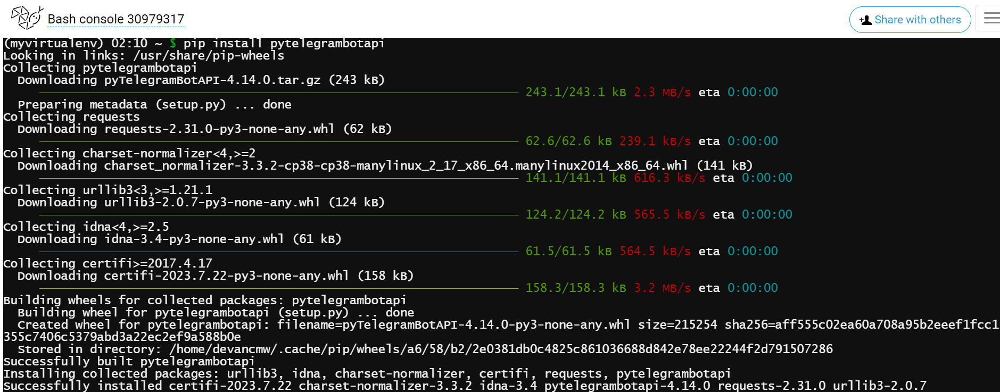
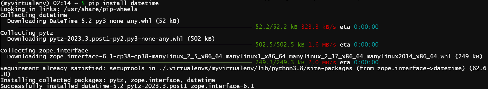
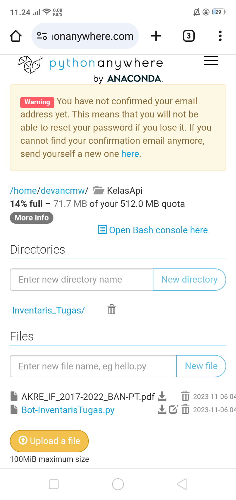

[](https://github.com/ellerbrock/open-source-badges/)
[](https://opensource.org/licenses/MIT)


# Bot-Telegram-Python-Inventaris-Tugas
<strong>Tugas Akhir ke-2 dalam Pemrograman API</strong><br>

Proyek ini sangat erat kaitannya dengan bot telegram, yang mana bot telegram sendiri memiliki peran penting dalam kegiatan belajar mengajar di kelas. Bot ini dapat melakukan inventarisasi tugas secara berkala. Bot ini dibangun dengan bantuan sebuah platform yang bernama ``` pythonanywhere ```. Pada proyek ini, pembuat program menggunakan ``` python versi 3.6 ``` karena dikenal memiliki kelebihan dalam sintaksis. Tujuan dari proyek ini adalah untuk membantu dosen atau guru dalam menginventarisir tugas-tugas siswanya dan mengantisipasi kesalahan yang mungkin terjadi yaitu lupa merekap, hal ini dikarenakan kesibukan aktivitas berkirim pesan dalam sebuah grup media sosial kelas, dalam hal ini telegram.

<br><br>

## Kebutuhan Proyek
| Bagian | Deskripsi |
| --- | --- |
| Fitur | Keyboard Balasan, Keyboard Sebaris, Pengendalian Masalah, Inventarisasi, Aktivitas Catatan Pengguna |
| Platform | Pythonanywhere |
| Pustaka | telebot, datetime |
| Kode | Python 3.6 |

<br><br>

## Kemampuan Bot
1. Terdapat pilihan menu yang dapat diakses dengan mengklik atau mengetik.<br><br>
   
2. Aplikasi ini juga dapat mendeteksi file atau dokumen yang masuk dan memberitahukan pengirimnya secara langsung.<br><br>
   
3. Kemampuan lain dari bot ini adalah dapat memberikan notifikasi kepada pemilik bot bahwa ada seseorang yang mengakses menu tertentu, sehingga pemilik bot dapat memantau pergerakan yang terjadi secara langsung.<br><br>
   
4. Bot ini dapat menyapa pengguna grup dan pengguna non-grup.<br><br>
   
5. Terdapat kontrol masalah dalam sistem, jika pesan tidak sesuai dengan perintah, maka akan dialihkan ke perintah ``` /help ```.

<br><br>

## Memulai
1. Unduh repositori ini dan ekstrak.<br><br>
   
2. Daftar ``` akun pythonanywhere ``` :

   <table><tr><td width="810">

   ```
   https://www.pythonanywhere.com/registration/register/beginner/
   ```

   </td></tr></table><br>
   
3. Masuk ``` akun pythonanywhere ```.<br><br>
   
4. Buat direktori baru pada ``` platform pythonanywhere ``` dengan mengklik ``` Files ``` yang ada di bagian atas -> Ketik di bagian ``` Directories ```: ``` KelasApi ``` -> Klik ``` New directory ```.<br><br>

5. Kemudian unggah ``` Bot-InventarisTugas.py ``` dengan mengklik tombol ``` Upload a file ```.<br><br>

6. Kembali ke halaman sebelumnya, yaitu di ``` /home/[pythonanywhere username] ``` -> Klik ``` Open Bash console here ```.<br><br>
  
7. Kemudian ketik ini di konsol secara bergantian:

   <table><tr><td width="810">

   ```python
   mkvirtualenv myvirtualenv --python=/usr/bin/python3
   ```   

   
   
   </td></tr></table><br>
   <table><tr><td width="810">
      
   ```python
   pip install pytelegrambotapi
   ```

   

   </td></tr></table><br>
   <table><tr><td width="810">
      
   ```python
   pip install datetime
   ```

   
   
   </td></tr></table><br>
   <table><tr><td width="810">
      
   ```python
   cd KelasApi
   ```

   
   
   </td></tr></table><br>
   <table><tr><td width="810">

   ```bash
   python3 Bot-InventarisTugas.py
   ```

   
   
   </td></tr></table><br>
   
8. Selamat menikmati [Selesai].

<br><br>

## Pengingat
• Perhatikan penulisan sintaks yang baik dan benar karena python peka terhadap huruf besar/kecil.

• Pastikan PC/Laptop anda terhubung ke internet.

<br><br>

## Sorotan
<table>
<tr>
<th colspan="4">Bot Telegram</th>
</tr>
<tr>
<td width="280"></td>
<td width="280"></td>
<td width="280"></td>
</tr>
<tr>
<td width="280"></td>
<td width="280"></td>
<td width="280"></td>
</tr>
</table>

<br><br>

## Demonstrasi Aplikasi
Via Telegram: <a href="http://t.me/inventaristugas_bot">@inventaristugas_bot</a>

<br><br>

## Apresiasi
Jika karya ini bermanfaat bagi anda, maka dukunglah karya ini sebagai bentuk apresiasi kepada penulis dengan mengklik tombol ``` ⭐Bintang ``` di bagian atas repositori.

<br><br>

## Penafian
Aplikasi ini merupakan hasil karya saya sendiri dan bukan merupakan hasil plagiat dari penelitian atau karya orang lain, kecuali yang berkaitan dengan layanan pihak ketiga yang meliputi: pustaka, kerangka kerja, dan lain sebagainya.

<br><br>

## LISENSI 
LISENSI MIT - Hak Cipta © 2020 - Devan C. M. Wijaya

Dengan ini diberikan izin tanpa biaya kepada siapa pun yang mendapatkan salinan perangkat lunak ini dan file dokumentasi terkait perangkat lunak untuk menggunakannya tanpa batasan, termasuk namun tidak terbatas pada hak untuk menggunakan, menyalin, memodifikasi, menggabungkan, mempublikasikan, mendistribusikan, mensublisensikan, dan/atau menjual salinan Perangkat Lunak ini, dan mengizinkan orang yang menerima Perangkat Lunak ini untuk dilengkapi dengan persyaratan berikut:

Pemberitahuan hak cipta di atas dan pemberitahuan izin ini harus menyertai semua salinan atau bagian penting dari Perangkat Lunak.

DALAM HAL APAPUN, PENULIS ATAU PEMEGANG HAK CIPTA DI SINI TETAP MEMILIKI HAK KEPEMILIKAN PENUH. PERANGKAT LUNAK INI DISEDIAKAN SEBAGAIMANA ADANYA, TANPA JAMINAN APAPUN, BAIK TERSURAT MAUPUN TERSIRAT, OLEH KARENA ITU JIKA TERJADI KERUSAKAN, KEHILANGAN, ATAU LAINNYA YANG TIMBUL DARI PENGGUNAAN ATAU URUSAN LAIN DALAM PERANGKAT LUNAK INI, PENULIS ATAU PEMEGANG HAK CIPTA TIDAK BERTANGGUNG JAWAB, KARENA PENGGUNAAN PERANGKAT LUNAK INI TIDAK DIPAKSAKAN SAMA SEKALI, SEHINGGA RISIKO ADALAH MILIK ANDA SENDIRI.
